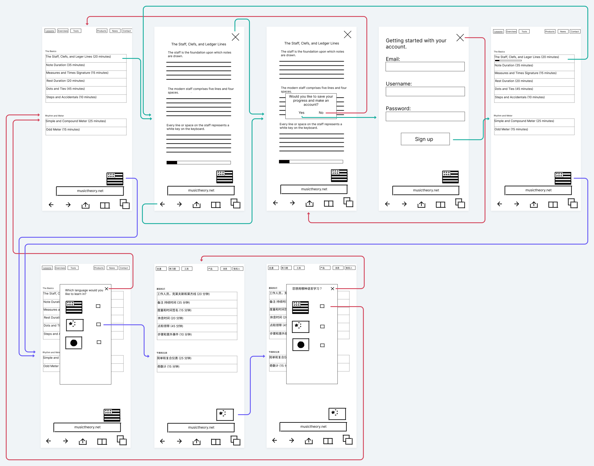

# ASSIGNMENT05-CHRIS-HUNT-DH110

## Low Fidelity Prototype

I want to redesign musictheory.net to provide a better user experience to anyone who will use the app. To achieve this I will talk to users who fit the demographics as well as others who are interested in such an application that they can provide feedback that will help push along the design to create a better experience.

From the personas that I created I learned that I need some way of tracking how long the lesson would take to complete, how much of the is currently done (progress bar) that is able to be seen inside the lesson as well as from the lesson tab, sign up for users to save their progress, ability to change languages.

The purpose of low fidelity prototyping is to see if the logic makes sense as to what you’re trying to get the user to use the functions you want to implement into the website or app you are working with. It also gives another opportunity for users to suggest stuff to be added or moved around to make their experience better. It gives you a chance to make sure you’re heading down the right path with the information gathered from research you’ve done in prior parts of your project.

### Task

1. Saving progress/creating an account to save progress
2. Change languages
3. Track progress/how long a lesson will take

### Prototype

### Prototype Testing

Gwydion

Ian

### Reflection

The process went a lot faster than I expected. Also, the participants didn’t want to be recorded and didn’t write down their thoughts or notations. Because of this I asked two people to look over the wireframe/wireflow. By having two people look over it I got different opinions thus giving me more feedback and stuff to work on.

I would try to find users who want to be recorded or at least an audio recording so when I get back and make changes based on their notes on the wireframe/wireflow they wrote comments on I can listen to the video or audio recording to make sure I didn’t miss anything. Also asking the users throughout the process what their thoughts are more often. Because of the feedback I got I would add an account option that shows you the account so you can sign in or create an account at any time. I also would like to make the progress bar more understandable but maybe because the design is in black and white the user can’t tell what it is exactly and just sees a bar with a tiny amount black filled up. I also want to change the activity time to be estimated rather than set times because some people are slower and others are faster when it comes to time to complete an activity. I would also want to add a text label for the language so people know exactly which language it was, like simplified Chinese or American english. For the wireframe/wireflow I would also add text explaining what each thing does so the users have a better understanding of what is going on.

My first user Ian didn’t know what the progress bar was. I would hope to make it clear by possibly adding a % next to it or inside of it saying like 30% so then they can put together 30% complete and maybe adding a wireframe going to the next part of the lesson and showing the progress bar go up to 40% etc. He also wasn’t sure where to login after you make your account and sign up so I would add a profile tab on the website that  you can access from the general tabs (not while in a lesson). My second user Gwydion didn’t know which language was which because China uses simplified and traditional. In a revision I would add text next to or below the flags saying which language is which making it clear as to which language they are choosing. He also said he wanted to see a text explanation of what the flow means so he doesn’t have to ask that many questions regarding what is going on.
